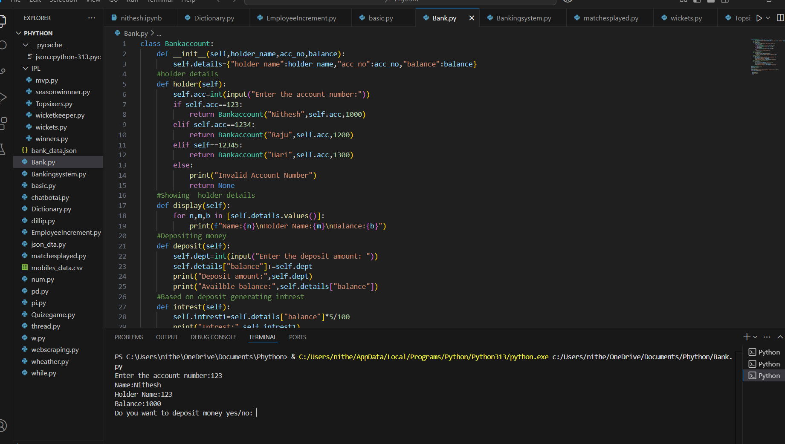

# 🏦 Mini Bank System (Python Project)

A simple command-line banking system developed using Python. This project simulates basic banking operations such as account login, depositing money, calculating interest, and showing account details.

---

## 📌 Features

- ✅ Account authentication using account number
- 💸 Deposit money and update balance
- 📈 Calculate 5% interest on current balance
- 📊 Display account holder details

---

##  Screenshots

### 🔐 Account Login & Balance Display


### 💸 Deposit and Interest Applied


---

## 🧠 Concepts Used

- Python Classes and Object-Oriented Programming (OOP)
- While Loops and Conditionals
- Function usage inside loops
- Dictionary data structure

---

##  How to Run

### 🛠 Requirements:
- Python 3.x installed

###  Steps to run:
```bash
python Bank.py
